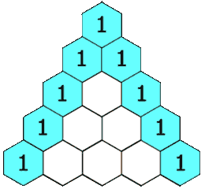

# C++ Programs Collection for Beginners

<!--[Studytonight
](https://www.studytonight.com/cpp-programs/cpp-adding-two-numbers-program) -->

> I want to challenge myself to daily solve at least one program in C++ to gain confidence in C++ syntax.

> My target is add atleast **100 programs** to this github repo.

> After my challenge is over, this repo is going to be a valuable resource for those who are new to programming with C++. It will contain over 100 C++ programs that cover the following topics:


## Topics Covered:

- Basics
- Loops
- Patterns
- Numbers
- Arrays
- Strings
- Sorting
- Searching
- OOP
- File Handling
- STL
- Miscellaneous

## Objectives in mind:

- Practice and improve C++ programming skills
- Better understanding of C++ syntax, coding conventions, and best practices
- Learn to solve common problems and develop efficient solutions
- Work through so many programs to gain confidence and become proficient C++ programmers.

## Programs Listing:

---

### Basics

1. Hello World Program
2. Program to add two numbers and print output
3. Check if the number is Positive or Negative Program
4. Find the ASCII value of the character program

### Loops

5. Program To Find Sum Of Series 1 + 2 + 3 + 4 + 5 + . . . . . . . . . . . . . . . . n
6. Program Print Truth Table Of XY+Z Using Loop
7. Program To Find Sum Of Series 1 + 1 / 2 ^ 2 + 1 / 3 ^ 3 + . . . . . . . . . . . . 1 / n ^ n
8. Program To Find Sum Of Series 1 + 2 + 4 + 8 + 16 + 32 + . . . . . . . . n

### Patterns

9. Program To Print Heart Pattern


10. Print INDIA Pattern

```
I
IN
IND
INDI
INDIA
```

11. Program To Find Sum Of Series 1 ^ 2 + 3 ^ 2 + 5 ^ 2 + . . . . . . . . . . . n ^ 2
12. Program To Find Sum Of Series 1 + x ^ 1 + x ^ 2 + x ^ 3 + . . . . . . . . . x ^ n
13. C++ Program To Print The Series 1 -4 7 -10. . . . . -40
14. Program To Print Half Pyramid Alternative
    Output:  
    Enter the No Of Row : 6

```
*
*A
*A*
*A*A
*A*A*
*A*A*A
```

15. Program To Find Sum Of Series x + x ^ 2 / 2 + x ^ 3 / 3 + x ^ 4 / 4 + . . . . . . . . . x ^ n / n

16. Program To Print A Given Pattern Or Series Like 12345, 5432, 234, 43, 3

17. Program For Draw A Perfect Christmas Tree using stars as below

```
Output:
Enter the number of floors in the christmas Tree : 4
Enter the height of foot : 4
Enter the width of foot (should be odd) : 3
                  *
                * * *
              * * * * *
            * * * * * * *
              * * * * *
            * * * * * * *
          * * * * * * * * *
        * * * * * * * * * * *
          * * * * * * * * *
        * * * * * * * * * * *
      * * * * * * * * * * * * *
    * * * * * * * * * * * * * * *
      * * * * * * * * * * * * *
    * * * * * * * * * * * * * * *
  * * * * * * * * * * * * * * * * *
* * * * * * * * * * * * * * * * * * *
                * * *
                * * *
                * * *
                * * *
```

18. Program to Print Half Pyramid using stars

```
*
* *
* * *
* * * *
* * * * *
* * * * * *
```

19. Program To Find Sum Of Series 1 / 2 + 4 / 5 + 7 / 8 + . . . . . . . . .n
20. Program To Print Reverse Half Pyramid

```
Enter number of rows: 5
* * * * *
* * * *
* * *
* *
*
```

21. Program To Print A Pascal Triangle

```
Enter number of rows: 4
1
1 1
1 2 1
1 3 3 1
```



22. Program to print daimond pattern using stars (\*)

```
Enter Diamond Star Pattern Row = 9
Diamond Star Pattern
        *
       ***
      *****
     *******
    *********
   ***********
  *************
 ***************
*****************
 ***************
  *************
   ***********
    *********
     *******
      *****
       ***
        *
```

23. Program to Print Half Pyramid Pattern using Numbers Program

```
Enter the number of rows in the pyramid: 4

1
1 2
1 2 3
1 2 3 4
```

24. Half Pyramid Pattern using Characters Program

```
Enter the number of rows in the pyramid: 4
A
A B
A B C
A B C D
A B C D E
```

25. Program to print Reverse Half Pyramid Pattern using Numbers

```
Enter the no. of rows : 4
1 2 3 4
1 2 3
1 2
1
```

26. Program to print Reverse Half Pyramid Pattern using Characters

```
Enter the number of rows in the pyramid: 4
A B C D
A B C
A B
A
```

27. Floyd's Triangle Program

```
Enter the number of rows in the pyramid: 4

1
2 3
4 5 6
7 8 9 10
```

28. Modified Floyd's Triangle Program

```
Enter the number of rows in the pyramid: 5

1
2 3
3 4 5
4 5 6 7
5 6 7 8 9
```
### Numbers

29. Program To Check Number Is Prime Or Not Using If/Else Statements

30. Program To Find Max Number Among Given Three Number Using If/Else Statements

31. Program To Check Number Is Palindrome Or Not
32. Program To Find A Grade Of Given Numbers Using Switch Case

Score in subject Grade

| score | grade |
| :---: | :---- |
| >=90  | A     |
| 80-89 | B     |
| 70-79 | C     |
| 60-69 | D     |
| 50-59 | E     |
|  <50  | F     |

33. Program Swap Two numbers without using 3rd variable

34. Program To Check Number Is Even Or Odd Using If/Else Statements

35. Program to Convert Decimal Number To Binary Number Using Loop

36. Program to calculate Standard Deviation Using Function


37. Swap Two number using functions and pointers

38. Program to find Fibonacci series

  i. Fibonacci Series up to n number of terms

  ii. Program to Generate Fibonacci Sequence Up to a Certain Number

39. Program To Find GCD (Greatest Common Divisor ) Using Functions

40. Find Sum of n Numbers entered by the User
41. Check whether the given Number is Even or Odd
42. Factorial of a given Number Program
43. Square root and Cube root of a given Number
44. Program to find GCD and LCM
45. Check whether the number is Armstrong or not
46. Count Number of Digits in a given Number
47. Determine Perfect Square Program
48. Determine if the Number is Prime or Composite
49. Find the Reverse of the Entered Number
50. Palindrome Check for a given Number


 
